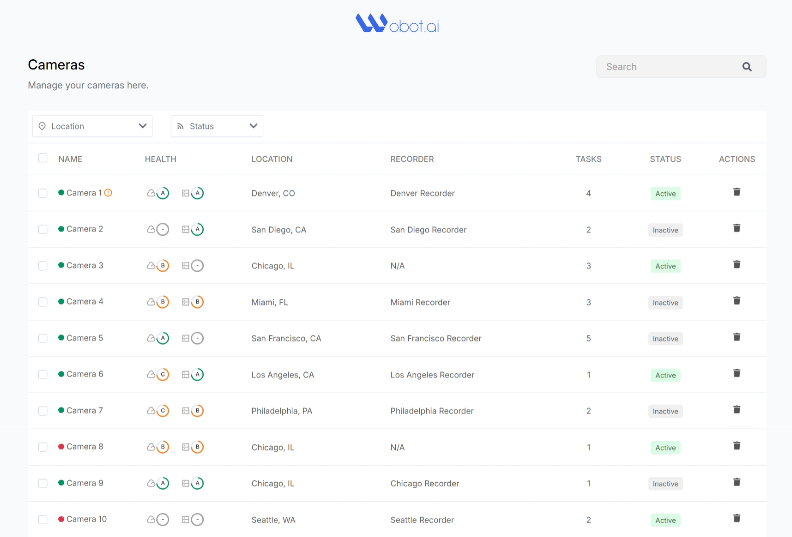
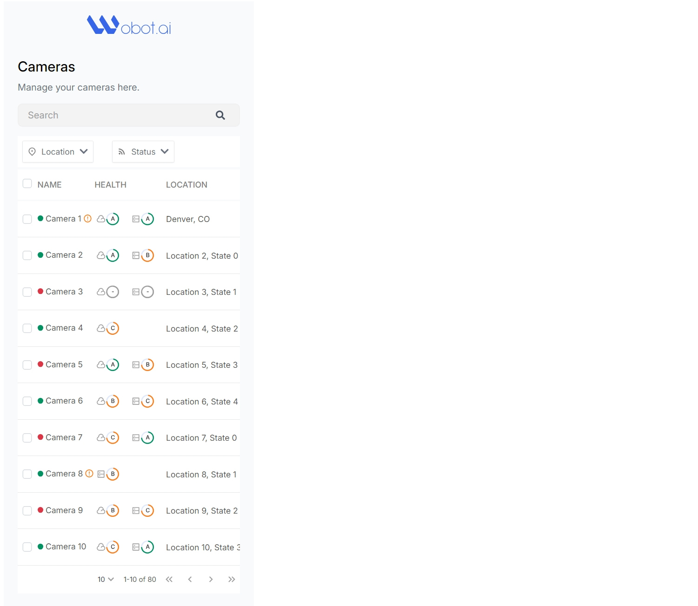

# Wobot AI Cameras Dashboard

URL: https://wobot-ai-dun.vercel.app/




## Features

- UI is mobile responsive
- API Integration
- Debouncing hook for camera search
- Location and Status Filters
- Status toggle "Active" | "Inactive"
- Delete Functionality
- Pagination
- Per page item selector
- Horizontal scrollbar in table for mobile
- Scrollbars for long select items list
- Figma-aligned CSS design
- Reusable components
- Centralized store via Context API hook
- Clean code with useful comments

## To run on your machine

Follow these steps to clone, set up, and run the project:

1. **Clone the repository**  
   Open a terminal and run the following command:

   ```bash
   git clone https://github.com/akshaydhame2001/WobotAI.git

   ```

2. **Navigate to the project directory**
   Once cloned, navigate to the project directory:

   ```bash
   cd WobotAI
   ```

3. **Install dependencies**
   Run the following command to install all the required dependencies:

   ```bash
   npm install
   ```

4. **Set Environment Variables**
   Create .env file

   ```bash
   REACT_APP_BEARER_TOKEN="YOUR_WOBOTAI_TOKEN"
   ```

5. **Run the project**
   To start the application, run:
   ```bash
   npm start
   ```

This will start the development server, and you can view the dashboard in your browser at http://localhost:3000.

- Camera Fetch API (GET): https://api-app-staging.wobot.ai/app/v1/fetch/cameras
- Camera Status API (PUT): https://api-app-staging.wobot.ai/app/v1/update/camera/status
